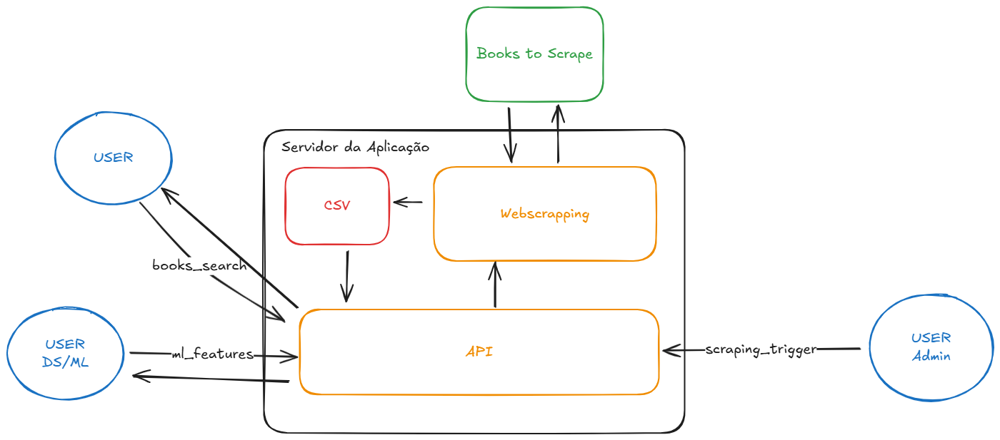

# Projeto: API de Consulta de Livros

### Índice

1.  [Descrição do Projeto e Arquitetura](#1-descrição-do-projeto-e-arquitetura)
      * [API em Produção](#-api-em-produção)
      * [Vídeo de Apresentação](#vídeo-de-apresentação-pitch)
      * [Diagrama da Arquitetura](#diagrama-da-arquitetura)
2.  [Como Usar a API](#2-como-usar-a-api)
      * [Opção 1: Usar a API em Produção](#opção-1-usar-a-api-em-produção-recomendado)
      * [Opção 2: Executar o Projeto Localmente](#opção-2-executar-o-projeto-localmente)
3.  [Documentação das Rotas da API](#3-documentação-das-rotas-da-api)
4.  [Exemplos de Chamadas](#4-exemplos-de-chamadas)

-----

## 1\. Descrição do Projeto e Arquitetura

### Descrição

Este projeto implementa uma solução completa para a extração e consulta de dados de livros, combinando um web scraper com uma API RESTful.

  * **Web Scraper**: Um script (`scripts/webscraping_livros.py`) utiliza Selenium para extrair dados detalhados de livros do site [Books to Scrape](http://books.toscrape.com), guardando as informações num CSV.
  * **API REST**: Uma API (`api/main.py`) construída com FastAPI que serve os dados extraídos através de múltiplos endpoints. A API inclui funcionalidades de pesquisa, filtros, estatísticas, autenticação de utilizadores com JWT e endpoints protegidos para tarefas administrativas.

O projeto também inclui a preparação de dados para futuros modelos de Machine Learning, logging estruturado, e métricas no padrão Prometheus para monitorização.

### 🚀 **API em Produção**

A API está implantada e disponível para uso em:

**[https://consulta-livros.onrender.com/](https://consulta-livros.onrender.com/)**

A documentação interativa (Swagger UI) pode ser acedida em:

**[https://consulta-livros.onrender.com/docs](https://consulta-livros.onrender.com/docs)**

### Vídeo de Apresentação (Pitch)

[Vídeo de Apresentação](https://youtu.be/NwEYryrF8EE)

### Diagrama da Arquitetura



### Arquitetura

O projeto é modular e está organizado da seguinte forma para separar responsabilidades:

  * **/api**: Contém a lógica da aplicação FastAPI.
  * **/database**: Responsável pela interação com a base de dados de utilizadores.
  * **/models**: Define os esquemas de dados (Pydantic e SQLAlchemy).
  * **/scripts**: Contém scripts autónomos como o web scraper e o processamento de dados.
  * **/data**: Armazena o CSV com os dados dos livros.

## 2\. Como Usar a API

### Opção 1: Usar a API em Produção (Recomendado)

A maneira mais fácil de testar é usar a versão ao vivo. Não é necessária nenhuma instalação.

1.  **Explore os Endpoints**: Abra a [documentação interativa](https://consulta-livros.onrender.com/docs) para ver e testar todas as rotas diretamente no seu navegador.
2.  **Autenticação**: Para usar as rotas protegidas, obtenha um token de acesso fazendo um `POST` para `https://consulta-livros.onrender.com/api/v1/auth/login` com as credenciais `admin` / `admin123`.

### Opção 2: Executar o Projeto Localmente

Siga estes passos se quiser executar a API no seu próprio computador para desenvolvimento. Execute todos os comandos a partir da pasta raiz do projeto.

**Pré-requisito**: Python 3.10+

1.  **Instale as dependências**:

    ```bash
    pip install -r requirements.txt
    ```

2.  **Inicialize a Base de Dados**: Este comando cria a base de dados de utilizadores e adiciona um utilizador `admin` com a senha `admin123`. Execute-o apenas uma vez.

    ```bash
    python database/init_db.py
    ```

3.  **Inicie a API**:

    ```bash
    uvicorn api.main:app --reload
    ```

    O servidor estará a correr em `http://127.0.0.1:8000`.

4.  **(Opcional) Execute o Web Scraper**: Se o ficheiro `data/info_livros.csv` não existir, acione o scraping através da API local (ver exemplos na secção 4, usando o URL local).

## 3\. Documentação das Rotas da API

A documentação completa e interativa para todas as rotas está disponível em **[Swagger UI](https://consulta-livros.onrender.com/docs)**.

Abaixo está um resumo das rotas disponíveis:

### Status

  * `GET /api/v1/health`

### Livros

  * `GET /api/v1/books`
  * `GET /api/v1/books/{id_livro}`
  * `GET /api/v1/books/search`
  * `GET /api/v1/books/top-rated`
  * `GET /api/v1/books/price-range`

### Categorias

  * `GET /api/v1/categories`

### Estatísticas

  * `GET /api/v1/stats/overview`
  * `GET /api/v1/stats/categories`

### Autenticação (Protegido por cadeado no Swagger)

  * `POST /api/v1/auth/login`
  * `POST /api/v1/auth/refresh`

### Admin (Protegido por cadeado no Swagger)

  * `POST /api/v1/scraping/trigger`

### Machine Learning

  * `GET /api/v1/ml/features`
  * `GET /api/v1/ml/training-data`
  * `POST /api/v1/ml/predictions`

## 4\. Exemplos de Chamadas

Estes exemplos utilizam a API em produção.

### Buscar um livro por ID

  * **Request**:
    ```http
    GET https://consulta-livros.onrender.com/api/v1/books/1
    ```
  * **Response** (Exemplo):
    ```json
    {
      "id": 1,
      "titulo": "Tipping the Velvet",
      "preco": 53.74,
      "avaliacao": 1,
      "disponibilidade": true,
      "estoque": 20,
      "categoria": "Historical",
      "imagem": "https://books.toscrape.com/media/cache/08/e9/08e94f3731d7d6b760dfbfbc02ca5c62.jpg"
    }
    ```

### Pesquisar livros por título

  * **Request**:
    ```http
    GET https://consulta-livros.onrender.com/api/v1/books/search?title=light
    ```
  * **Response**
    ```json
    [
        {
            "id": 1,
            "titulo": "Tipping the Velvet",
            "preco": 53.74,
            "avaliacao": 1,
            "disponibilidade": true,
            "estoque": 20,
            "categoria": "Historical",
            "imagem": "https://books.toscrape.com/media/cache/08/e9/08e94f3731d7d6b760dfbfbc02ca5c62.jpg"
        }
    ]
    ```

### Fazer Login

  * **Request**:
    ```bash
    curl -X POST "https://consulta-livros.onrender.com/api/v1/auth/login" \
    -H "Content-Type: application/x-www-form-urlencoded" \
    -d "username=admin&password=admin123"
    ```
  * **Response**:
    ```json
    {
      "access_token": "eyJhbGciOiJIUzI1NiIsInR5cCI6IkpXVCJ9...",
      "token_type": "bearer"
    }
    ```